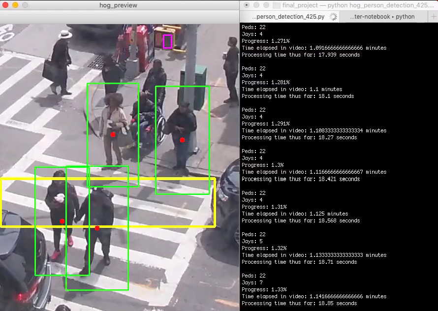

## Pedestrian Traffic Patterns

Sample from HOG-based human shape detection algorithm for tracking pedestrian flow in Downtown Brooklyn.

### Overview 

As my final project for our course in sensor technology at NYU in the Spring of 2019, I used a GoPro to record pedestrian flow in Downtown Brooklyn and then fed that data into a human detection algorithm to count pedestrian crossings at a specific intersection. The purpose of the study was to understand the frequency of jaywalking, which could provide insight into shortcomings in the design of this intersection and, potentially, others like it.

I borrowed heavily from code created by Madhawa Vidanapathirana, who has posted scripts in Python using various shape detection algorithms to study pedestrian flow (huge thanks to Madhawa, check his awesome work out here: https://gist.github.com/madhawav). 

Using his code as a starting point, I added shapes and counters to track ordinary crossings and the frequency of jaywalking at the intersection of Jay Street and Willoughby Street in [Brooklyn](https://www.google.com/maps/place/Jay+St+-+MetroTech+Station/@40.6922507,-73.9878264,19z/data=!3m1!4b1!4m5!3m4!1s0x89c25a4b934481c7:0x4f37e8720aab325!8m2!3d40.6922507!4d-73.9872792 "Brooklyn"):

I ended up trying different algorithms (HOG, Haar Cascade, CNN) for human shape detection. HOG and Haar Cascade were pretty accurate and way faster than CNN. But CNN tracked just about everything.

Take a look at the scripts here and feel free to give me feedback. I'm a novice when it comes to computer vision but would really like to improve.